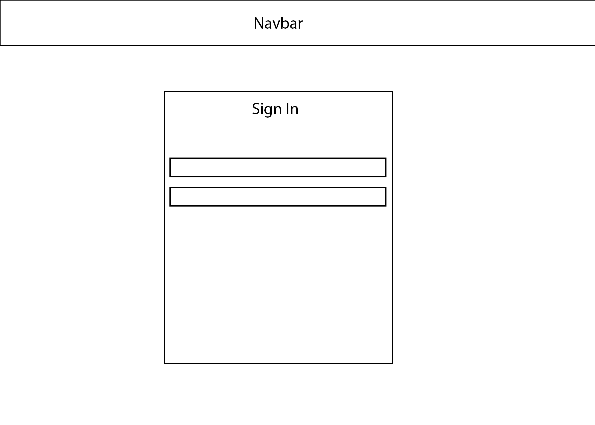
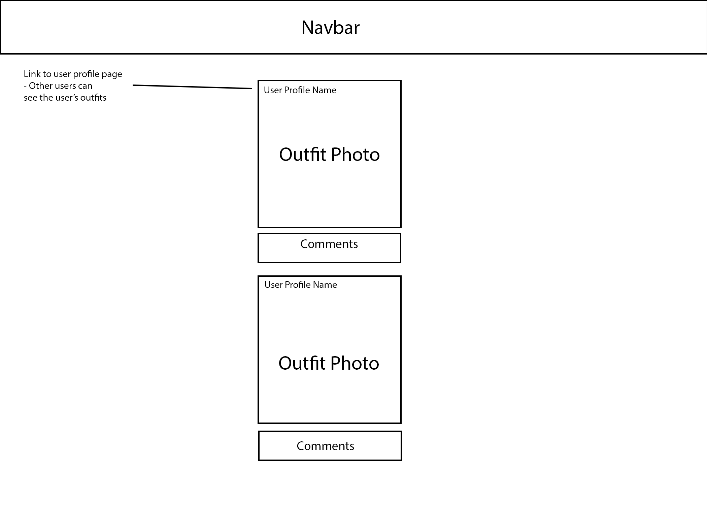
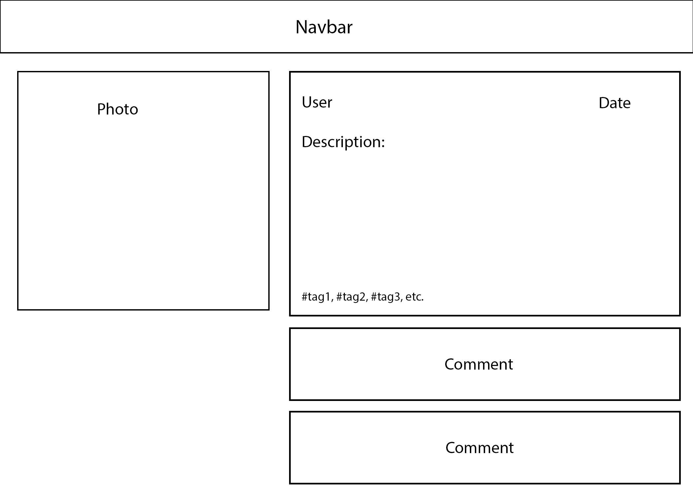
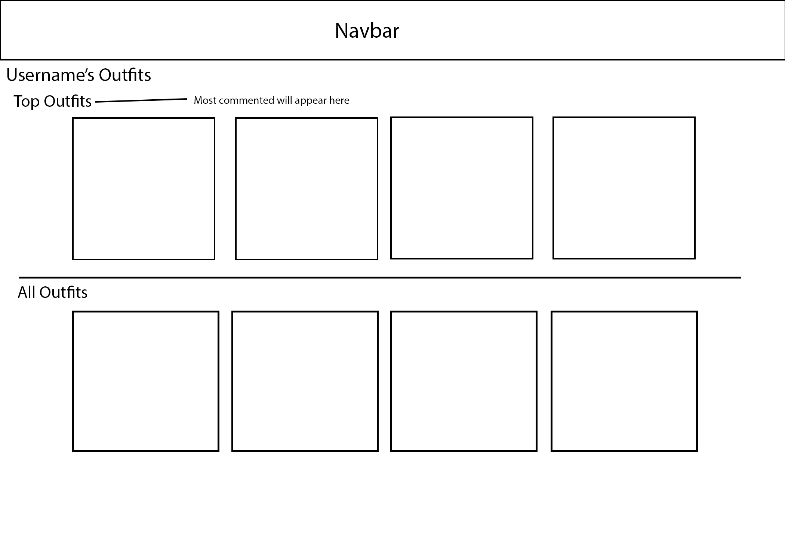

# Check my Fit Client

# User Story:
**As a Logged in User:**
- they will to be able to look through a feed of outfits uploaded by other users
- they will be able to click on individual outfits to see more details, previous comments, & be able to add a comment
- they will be able to upload personal outfits, with a description
- they will be able to their or another users profile page and see a list of their outfits 

# Wireframe:
## Sign in page:

## Index Page of all the Outfits: 

## Show Page:

## User Profile of Outfits

 

# Approach Taken:
- create restful routes to be able to format an index, edit, show, and delete function
- use axios to pull in data from API to render to the client 
- format pages through react

# Installation Instructions:

# Tech Used:
- HTML
- Javascript
- React
- Boostrap
- CSS
- Axios
- Mongodb
- Mongoose

